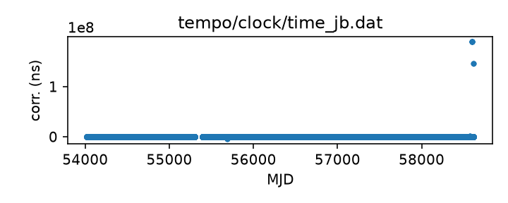
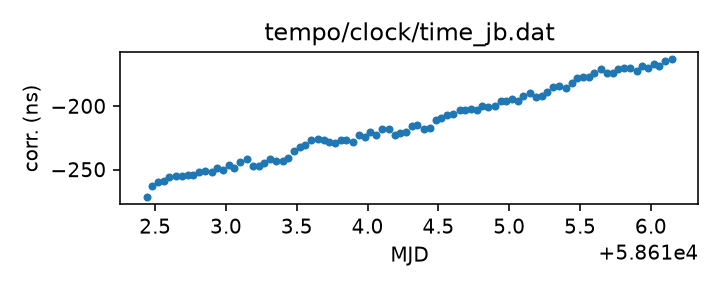

## Jodrell Bank (TEMPO)

Jodrell Bank clock correction file

This file is pulled from the TEMPO repository and may not be fully
up-to-date.

|     |     |
|:--- |:--- |
| File | `tempo/clock/time_jb.dat` |
| Authority | temporary |
| URL in repository | <https://raw.githubusercontent.com/ipta/pulsar-clock-corrections/main/tempo/clock/time_jb.dat> |
| Original download URL | <https://sourceforge.net/p/tempo/tempo/ci/master/tree/clock/time_jb.dat?format=raw> |
| Format | tempo |
| Bogus last correction | True |
| Clock file start | 2006-10-13 MJD 54021.4 |
| Clock file end | 2019-05-13 MJD 58616.2 |
| Update interval (days) | 7 |
| Last update attempt | 2026-03-20 |
| Last update result | Failed to download |

Log entries from the last few update attempts:
```
2026-01-05 20:47:10.814 - Unchanged
2026-01-12 20:46:42.326 - Unchanged
2026-01-19 20:45:52.768 - Unchanged
2026-01-26 20:49:47.036 - Unchanged
2026-02-03 21:01:54.182 - Unchanged
2026-02-10 21:07:56.455 - Unchanged
2026-02-17 21:03:10.903 - Unchanged
2026-03-06 20:56:00.902 - Unchanged
2026-03-13 20:59:55.041 - Unchanged
2026-03-20 20:57:35.668 - Failed to download: The read operation timed out
```
[Full log](https://raw.githubusercontent.com/ipta/pulsar-clock-corrections/main/log/tempo/clock/time_jb.dat.log)


All clock corrections:



Recent clock corrections:



