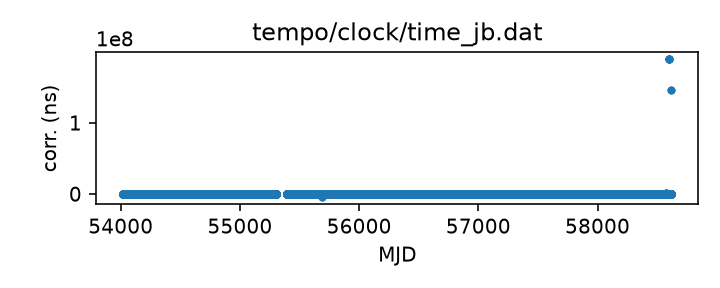
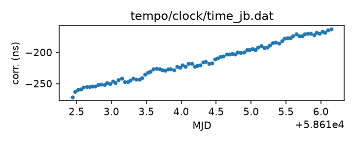

## Jodrell Bank (TEMPO)

Jodrell Bank clock correction file

This file is pulled from the TEMPO repository and may not be fully
up-to-date.

|     |     |
|:--- |:--- |
| File | `tempo/clock/time_jb.dat` |
| Authority | temporary |
| URL in repository | <https://raw.githubusercontent.com/ipta/pulsar-clock-corrections/main/tempo/clock/time_jb.dat> |
| Original download URL | <https://sourceforge.net/p/tempo/tempo/ci/master/tree/clock/time_jb.dat?format=raw> |
| Format | tempo |
| Bogus last correction | True |
| Clock file start | 2006-10-13 MJD 54021.4 |
| Clock file end | 2019-05-13 MJD 58616.2 |
| Update interval (days) | 7 |
| Last update attempt | 2026-09-05 |
| Last update result | Unchanged |

Log entries from the last few update attempts:
```
2026-07-03 21:39:51.011 - Unchanged
2026-07-10 21:34:58.628 - Unchanged
2026-07-17 21:15:56.747 - Unchanged
2026-07-24 21:36:55.772 - Unchanged
2026-07-31 21:37:25.850 - Unchanged
2026-08-07 21:04:51.061 - Unchanged
2026-08-14 20:54:57.744 - Unchanged
2026-08-21 20:48:47.476 - Unchanged
2026-08-29 02:51:52.980 - Unchanged
2026-09-05 22:10:20.072 - Unchanged
```
[Full log](https://raw.githubusercontent.com/ipta/pulsar-clock-corrections/main/log/tempo/clock/time_jb.dat.log)


All clock corrections:



Recent clock corrections:



