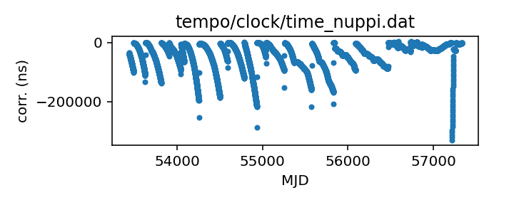
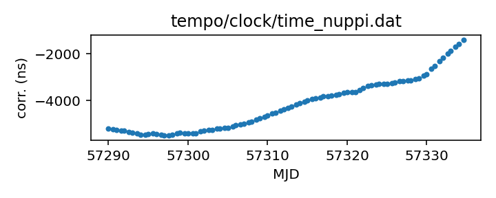

## NUPPI

Clock corrections specifically for the NUPPI backend at Nancay

This file is pulled from the TEMPO repository and may not be fully up-to-date.

|     |     |
|:--- |:--- |
| File | `tempo/clock/time_nuppi.dat` |
| Authority | temporary |
| URL in repository | <https://raw.githubusercontent.com/ipta/pulsar-clock-corrections/main/tempo/clock/time_nuppi.dat> |
| Original download URL | <https://sourceforge.net/p/tempo/tempo/ci/master/tree/clock/time_nuppi.dat?format=raw> |
| Format | tempo |
| Bogus last correction | False |
| Clock file start | 2005-03-07 MJD 53436.0 |
| Clock file end | 2015-11-08 MJD 57334.6 |
| Update interval (days) | 7 |
| Last update attempt | 2022-11-17 |
| Last update result | Unchanged |

Log entries from the last few update attempts:
```
2022-09-15 20:41:02.222 - Unchanged
2022-09-22 20:39:27.986 - Unchanged
2022-09-29 20:43:08.835 - Unchanged
2022-10-06 20:41:55.702 - Unchanged
2022-10-13 20:42:40.193 - Unchanged
2022-10-20 20:43:24.439 - Unchanged
2022-10-27 20:36:43.119 - Unchanged
2022-11-03 20:28:54.505 - Unchanged
2022-11-10 20:35:54.965 - Unchanged
2022-11-17 20:32:53.914 - Unchanged
```
[Full log](https://raw.githubusercontent.com/ipta/pulsar-clock-corrections/main/log/tempo/clock/time_nuppi.dat.log)


All clock corrections:



Recent clock corrections:



