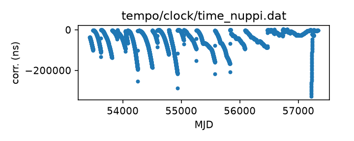
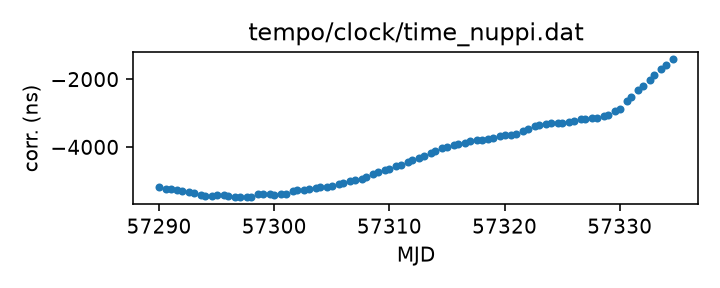

## NUPPI

Clock corrections specifically for the NUPPI backend at Nancay

This file is pulled from the TEMPO repository and may not be fully
up-to-date.

|     |     |
|:--- |:--- |
| File | `tempo/clock/time_nuppi.dat` |
| Authority | temporary |
| URL in repository | <https://raw.githubusercontent.com/ipta/pulsar-clock-corrections/main/tempo/clock/time_nuppi.dat> |
| Original download URL | <https://sourceforge.net/p/tempo/tempo/ci/master/tree/clock/time_nuppi.dat?format=raw> |
| Format | tempo |
| Bogus last correction | False |
| Clock file start | 2005-03-07 MJD 53436.0 |
| Clock file end | 2015-11-08 MJD 57334.6 |
| Update interval (days) | 7 |
| Last update attempt | 2026-07-17 |
| Last update result | Unchanged |

Log entries from the last few update attempts:
```
2026-05-15 21:35:39.842 - Unchanged
2026-05-22 21:43:19.386 - Unchanged
2026-05-29 22:14:10.995 - Unchanged
2026-06-05 21:54:10.993 - Unchanged
2026-06-12 22:06:19.244 - Unchanged
2026-06-19 21:42:57.722 - Unchanged
2026-06-26 21:48:35.494 - Unchanged
2026-07-03 21:39:57.841 - Unchanged
2026-07-10 21:35:06.131 - Unchanged
2026-07-17 21:16:04.418 - Unchanged
```
[Full log](https://raw.githubusercontent.com/ipta/pulsar-clock-corrections/main/log/tempo/clock/time_nuppi.dat.log)


All clock corrections:



Recent clock corrections:



