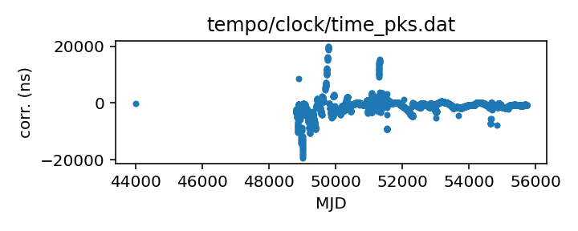
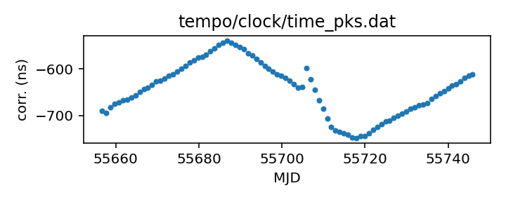

## Parkes (TEMPO)

Parkes observatory clock corrections (TEMPO format)

This file is pulled from the TEMPO repository and may not be fully up-to-date.

Note that this file has some clock (non-)correction data for other telescopes
in the same file, distinguished only by observatory code.

|     |     |
|:--- |:--- |
| File | `tempo/clock/time_pks.dat` |
| Authority | temporary |
| URL in repository | <https://raw.githubusercontent.com/ipta/pulsar-clock-corrections/main/tempo/clock/time_pks.dat> |
| Original download URL | <https://sourceforge.net/p/tempo/tempo/ci/master/tree/clock/time_pks.dat?format=raw> |
| Format | tempo |
| Bogus last correction | True |
| Clock file start | 1979-05-07 MJD 44000.0 |
| Clock file end | 2011-07-03 MJD 55745.8 |
| Update interval (days) | 7 |
| Last update attempt | 2022-10-06 |
| Last update result | Validation failed |

Log entries from the last few update attempts:
```
2022-08-04 20:34:41.857 - Validation failed: Unable to read new version of tempo/clock/time_pks.dat: Clock file /tmp/astropy-download-1668-z0equg7z appears to be out of order
2022-08-11 20:33:40.663 - Validation failed: Unable to read new version of tempo/clock/time_pks.dat: Clock file /tmp/astropy-download-1654-kb8uhgqd appears to be out of order
2022-08-18 20:36:52.446 - Validation failed: Unable to read new version of tempo/clock/time_pks.dat: Clock file /tmp/astropy-download-1707-2tdw70nb appears to be out of order
2022-08-25 20:34:57.712 - Validation failed: Unable to read new version of tempo/clock/time_pks.dat: Clock file /tmp/astropy-download-1692-lv4itl02 appears to be out of order
2022-09-01 20:35:43.659 - Validation failed: Unable to read new version of tempo/clock/time_pks.dat: Clock file /tmp/astropy-download-1662-_mam1wgo appears to be out of order
2022-09-08 20:39:25.855 - Validation failed: Unable to read new version of tempo/clock/time_pks.dat: Clock file /tmp/astropy-download-1540-5jc05c_g appears to be out of order
2022-09-15 20:41:00.949 - Validation failed: Unable to read new version of tempo/clock/time_pks.dat: Clock file /tmp/astropy-download-1665-hg0o4nmt appears to be out of order
2022-09-22 20:39:27.672 - Validation failed: Unable to read new version of tempo/clock/time_pks.dat: Clock file /tmp/astropy-download-1731-md2w727v appears to be out of order
2022-09-29 20:43:08.532 - Validation failed: Unable to read new version of tempo/clock/time_pks.dat: Clock file /tmp/astropy-download-1670-yxq_zqy5 appears to be out of order
2022-10-06 20:41:55.213 - Validation failed: Unable to read new version of tempo/clock/time_pks.dat: Clock file /tmp/astropy-download-1835-pho_7rq0 appears to be out of order
```
[Full log](https://raw.githubusercontent.com/ipta/pulsar-clock-corrections/main/log/tempo/clock/time_pks.dat.log)

Leading comments from clock file:

    # Irrelevant. -Anne Archibald 2022 May 26
    #  44000.0       0.0               2    ATCA
    #  60000.0       0.0               2    ATCA
    #  44000.0       0.0               H    JBmk2
    #  60000.0       0.0               H    JBmk2
    #  44000.0       0.0               E    MOST
    #  60000.0       0.0               E    MOST


All clock corrections:



Recent clock corrections:



