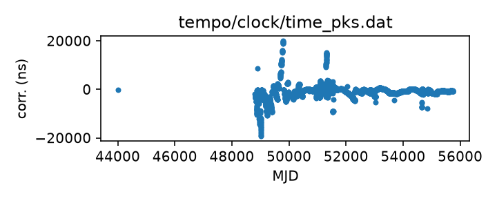
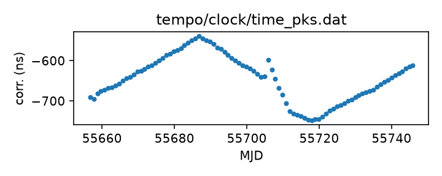

## Parkes (TEMPO)

Parkes observatory clock corrections (TEMPO format)

This file is pulled from the TEMPO repository and may not be fully
up-to-date.

Note that this file has some clock (non-)correction data for other
telescopes in the same file, distinguished only by observatory code.

|     |     |
|:--- |:--- |
| File | `tempo/clock/time_pks.dat` |
| Authority | temporary |
| URL in repository | <https://raw.githubusercontent.com/ipta/pulsar-clock-corrections/main/tempo/clock/time_pks.dat> |
| Original download URL | <https://sourceforge.net/p/tempo/tempo/ci/master/tree/clock/time_pks.dat?format=raw> |
| Format | tempo |
| Bogus last correction | True |
| Clock file start | 1979-05-07 MJD 44000.0 |
| Clock file end | 2011-07-03 MJD 55745.8 |
| Update interval (days) | 7 |
| Last update attempt | 2026-04-17 |
| Last update result | Unchanged |

Log entries from the last few update attempts:
```
2026-02-03 21:02:02.613 - Unchanged
2026-02-10 21:08:04.503 - Unchanged
2026-02-17 21:03:19.439 - Unchanged
2026-03-06 20:56:13.927 - Unchanged
2026-03-13 21:00:02.879 - Unchanged
2026-03-20 20:57:42.928 - Unchanged
2026-03-27 21:04:35.573 - Unchanged
2026-04-03 21:02:09.501 - Unchanged
2026-04-10 21:02:57.629 - Unchanged
2026-04-17 21:10:28.771 - Unchanged
```
[Full log](https://raw.githubusercontent.com/ipta/pulsar-clock-corrections/main/log/tempo/clock/time_pks.dat.log)


All clock corrections:



Recent clock corrections:



