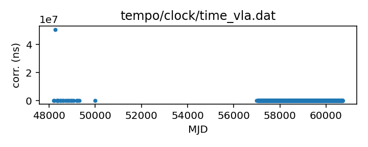
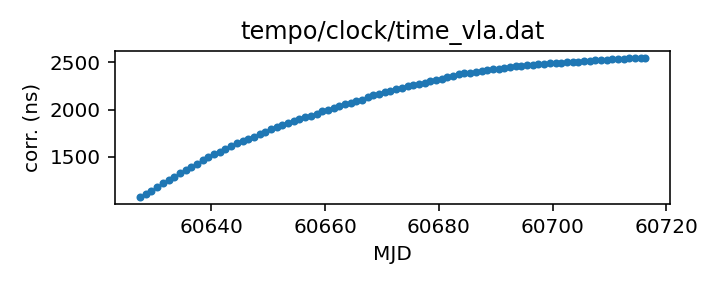

## VLA

Very Large Array clock corrections

This file is pulled from the TEMPO repository and may not be fully
up-to-date. 

|     |     |
|:--- |:--- |
| File | `tempo/clock/time_vla.dat` |
| Authority | temporary |
| URL in repository | <https://raw.githubusercontent.com/ipta/pulsar-clock-corrections/main/tempo/clock/time_vla.dat> |
| Original download URL | <https://sourceforge.net/p/tempo/tempo/ci/master/tree/clock/time_vla.dat?format=raw> |
| Format | tempo |
| Bogus last correction | False |
| Clock file start | 1990-10-27 MJD 48191.2 |
| Clock file end | 2025-02-10 MJD 60716.2 |
| Update interval (days) | 7 |
| Last update attempt | 2025-12-08 |
| Last update result | Unchanged |

Log entries from the last few update attempts:
```
2025-10-06 20:39:56.287 - Unchanged
2025-10-13 20:39:40.464 - Unchanged
2025-10-20 20:42:25.336 - Unchanged
2025-10-27 20:39:58.325 - Unchanged
2025-11-03 20:42:25.998 - Unchanged
2025-11-10 20:44:39.361 - Unchanged
2025-11-17 20:41:27.363 - Unchanged
2025-11-24 20:42:05.029 - Unchanged
2025-12-01 20:39:54.229 - Unchanged
2025-12-08 20:45:13.564 - Unchanged
```
[Full log](https://raw.githubusercontent.com/ipta/pulsar-clock-corrections/main/log/tempo/clock/time_vla.dat.log)


All clock corrections:



Recent clock corrections:



