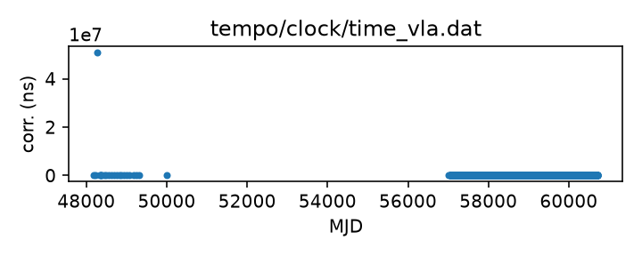
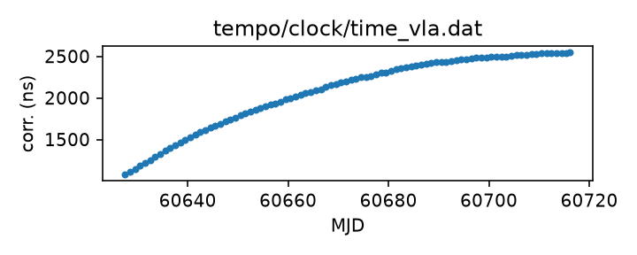

## VLA

Very Large Array clock corrections

This file is pulled from the TEMPO repository and may not be fully
up-to-date. 

|     |     |
|:--- |:--- |
| File | `tempo/clock/time_vla.dat` |
| Authority | temporary |
| URL in repository | <https://raw.githubusercontent.com/ipta/pulsar-clock-corrections/main/tempo/clock/time_vla.dat> |
| Original download URL | <https://sourceforge.net/p/tempo/tempo/ci/master/tree/clock/time_vla.dat?format=raw> |
| Format | tempo |
| Bogus last correction | False |
| Clock file start | 1990-10-27 MJD 48191.2 |
| Clock file end | 2025-02-10 MJD 60716.2 |
| Update interval (days) | 7 |
| Last update attempt | 2026-07-03 |
| Last update result | Unchanged |

Log entries from the last few update attempts:
```
2026-05-01 21:14:44.235 - Unchanged
2026-05-08 21:34:52.816 - Unchanged
2026-05-15 21:35:31.607 - Unchanged
2026-05-22 21:43:11.971 - Unchanged
2026-05-29 22:14:02.517 - Unchanged
2026-06-05 21:54:03.735 - Unchanged
2026-06-12 22:06:11.187 - Unchanged
2026-06-19 21:42:51.341 - Unchanged
2026-06-26 21:48:27.228 - Unchanged
2026-07-03 21:39:51.538 - Unchanged
```
[Full log](https://raw.githubusercontent.com/ipta/pulsar-clock-corrections/main/log/tempo/clock/time_vla.dat.log)


All clock corrections:



Recent clock corrections:



