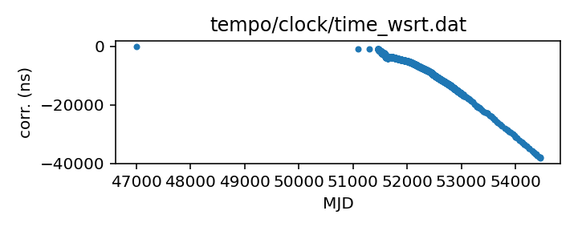
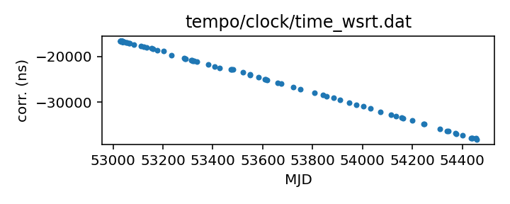

## WSRT (TEMPO)

WSRT clock corrections (TEMPO-format)

This file is pulled from the TEMPO repository and may not be fully
up-to-date.

This file may or may not agree with the TEMPO2-format version of what
should be the same information.

|     |     |
|:--- |:--- |
| File | `tempo/clock/time_wsrt.dat` |
| Authority | temporary |
| URL in repository | <https://raw.githubusercontent.com/ipta/pulsar-clock-corrections/main/tempo/clock/time_wsrt.dat> |
| Original download URL | <https://sourceforge.net/p/tempo/tempo/ci/master/tree/clock/time_wsrt.dat?format=raw> |
| Format | tempo |
| Bogus last correction | False |
| Clock file start | 1987-07-24 MJD 47000.0 |
| Clock file end | 2007-12-24 MJD 54458.0 |
| Update interval (days) | 7 |
| Last update attempt | 2024-01-04 |
| Last update result | Validation failed |

Log entries from the last few update attempts:
```
2023-03-09 20:31:04.679 - Validation failed: Unable to read new version of tempo/clock/time_wsrt.dat: Clock file /tmp/astropy-download-1730-rplajy6i appears to be out of order
2023-03-16 20:29:08.574 - Validation failed: Unable to read new version of tempo/clock/time_wsrt.dat: Clock file /tmp/astropy-download-1726-9go2yp7d appears to be out of order
2023-03-23 20:27:46.835 - Validation failed: Unable to read new version of tempo/clock/time_wsrt.dat: Clock file /tmp/astropy-download-1727-rkn_otsr appears to be out of order
2023-03-30 20:27:43.374 - Validation failed: Unable to read new version of tempo/clock/time_wsrt.dat: Clock file /tmp/astropy-download-1765-6yf73jao appears to be out of order
2023-04-06 20:26:11.700 - Validation failed: Unable to read new version of tempo/clock/time_wsrt.dat: Clock file /tmp/astropy-download-1741-ko2umq5t appears to be out of order
2023-12-07 20:29:37.655 - Validation failed: Unable to read new version of tempo/clock/time_wsrt.dat: Clock file /tmp/astropy-download-1928-e5omy2ev appears to be out of order
2023-12-14 20:29:33.906 - Validation failed: Unable to read new version of tempo/clock/time_wsrt.dat: Clock file /tmp/astropy-download-1915-y4akqfn9 appears to be out of order
2023-12-21 20:29:34.916 - Validation failed: Unable to read new version of tempo/clock/time_wsrt.dat: Clock file /tmp/astropy-download-1821-u_7ghfeo appears to be out of order
2023-12-28 20:29:25.846 - Validation failed: Unable to read new version of tempo/clock/time_wsrt.dat: Clock file /tmp/astropy-download-1937-w51qchpk appears to be out of order
2024-01-04 20:29:23.796 - Validation failed: Unable to read new version of tempo/clock/time_wsrt.dat: Clock file /tmp/astropy-download-1932-fzypdoq9 appears to be out of order
```
[Full log](https://raw.githubusercontent.com/ipta/pulsar-clock-corrections/main/log/tempo/clock/time_wsrt.dat.log)

Leading comments from clock file:

    # following clock offsets are from file:
    #   ~/tree/timing/1518+4904/work_08Jan01/from_gemma/wsrtgps.clk
    # converted to standard tempo format by:
    #   ~/tree/timing/1518+4904/work_08Jan01/do.convert.wsrtclk


All clock corrections:



Recent clock corrections:



