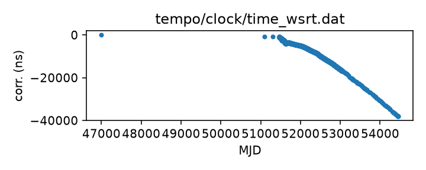
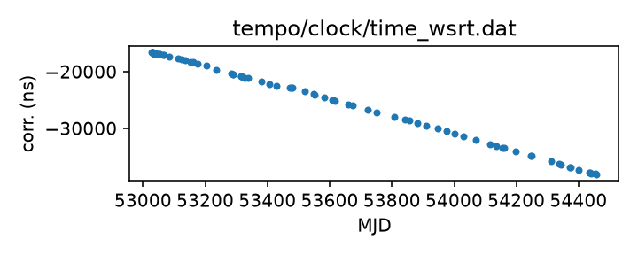

## WSRT (TEMPO)

WSRT clock corrections (TEMPO-format)

This file is pulled from the TEMPO repository and may not be fully
up-to-date.

This file may or may not agree with the TEMPO2-format version of what
should be the same information.

|     |     |
|:--- |:--- |
| File | `tempo/clock/time_wsrt.dat` |
| Authority | temporary |
| URL in repository | <https://raw.githubusercontent.com/ipta/pulsar-clock-corrections/main/tempo/clock/time_wsrt.dat> |
| Original download URL | <https://sourceforge.net/p/tempo/tempo/ci/master/tree/clock/time_wsrt.dat?format=raw> |
| Format | tempo |
| Bogus last correction | False |
| Clock file start | 1987-07-24 MJD 47000.0 |
| Clock file end | 2007-12-24 MJD 54458.0 |
| Update interval (days) | 7 |
| Last update attempt | 2026-07-10 |
| Last update result | Validation failed |

Log entries from the last few update attempts:
```
2026-05-08 21:34:53.787 - Validation failed: New version of tempo/clock/time_wsrt.dat MJDs differ from old version where they overlap in 5 places
2026-05-15 21:35:33.323 - Validation failed: New version of tempo/clock/time_wsrt.dat MJDs differ from old version where they overlap in 5 places
2026-05-22 21:43:13.454 - Validation failed: New version of tempo/clock/time_wsrt.dat MJDs differ from old version where they overlap in 5 places
2026-05-29 22:14:04.934 - Validation failed: New version of tempo/clock/time_wsrt.dat MJDs differ from old version where they overlap in 5 places
2026-06-05 21:54:04.794 - Validation failed: New version of tempo/clock/time_wsrt.dat MJDs differ from old version where they overlap in 5 places
2026-06-12 22:06:12.026 - Validation failed: New version of tempo/clock/time_wsrt.dat MJDs differ from old version where they overlap in 5 places
2026-06-19 21:42:52.115 - Validation failed: New version of tempo/clock/time_wsrt.dat MJDs differ from old version where they overlap in 5 places
2026-06-26 21:48:28.875 - Validation failed: New version of tempo/clock/time_wsrt.dat MJDs differ from old version where they overlap in 5 places
2026-07-03 21:39:52.261 - Validation failed: New version of tempo/clock/time_wsrt.dat MJDs differ from old version where they overlap in 5 places
2026-07-10 21:35:00.010 - Validation failed: New version of tempo/clock/time_wsrt.dat MJDs differ from old version where they overlap in 5 places
```
[Full log](https://raw.githubusercontent.com/ipta/pulsar-clock-corrections/main/log/tempo/clock/time_wsrt.dat.log)

Leading comments from clock file:

    # following clock offsets are from file:
    #   ~/tree/timing/1518+4904/work_08Jan01/from_gemma/wsrtgps.clk
    # converted to standard tempo format by:
    #   ~/tree/timing/1518+4904/work_08Jan01/do.convert.wsrtclk


All clock corrections:



Recent clock corrections:



